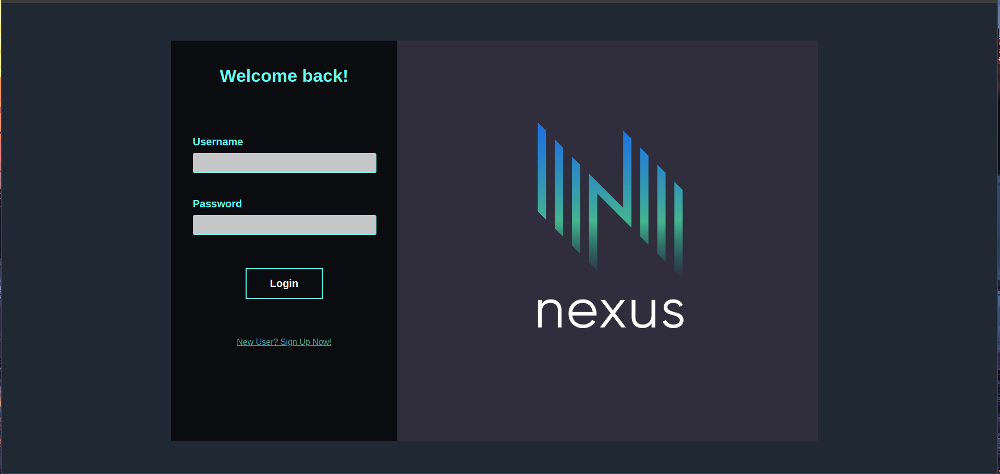
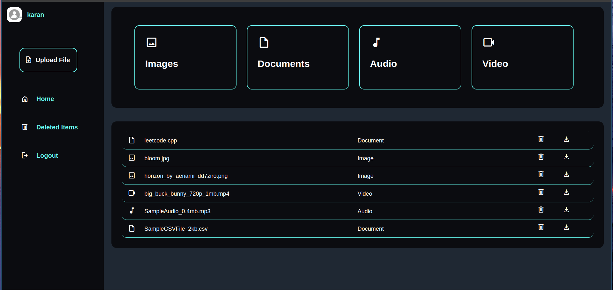

Nexus
-----

This project is designed to provide a scalable, reliable and efficient solution for storing
and retrieving files across multiple nodes in a distributed environment. Built with robust
backend in C++ and a modern, user-friendly web interface, this system offers an intuitive way 
to manage files seamlessly across different machines.

Features
--------

- Scalability: Utilizes AWS S3 buckets as storage nodes, allowing easy scaling by creating 
additional buckets in different regions.

- Reliability: Ensures data redundancy and integrity through replication of same data to multiple
nodes, ensuring data availability.

- Efficiency: Data is split into chunks and distributed using an optimized hash function for 
efficient retrieval.

- Security: Data is encrypted during transfer and decrypted only upon user request.

- User-Friendly: Provides a user-friendly web interface powered by a C++ backend using the [Crow](https://crowcpp.org/maste)                 REST API library.

Images
------




## Getting Started

### Dependencies 

- GCC Compiler Version: C++17 or higher.
- Boost libraries.
- [rapidjson](https://rapidjson.org/) (Used for json data parsing).
- [CrowCpp](https://crowcpp.org/master/) (Used as REST Api for Web Interface).
- [Crypto++](https://github.com/weidai11/cryptopp) (Used for encryption).
- [AWS SDK for C++](https://github.com/aws/aws-sdk-cpp) (Standard AWS Development Kit for C++).
- MySQL (Used as database)

### Steps to get Started

- **Clone the repository**
    ```bash
    git clone https://github.com/Karan2004xd/Nexus

- **Connect with your AWS Account**
    - There are several ways to authenticate your user to aws but one of the easy way is to
    use **aws-cli**.
     ```bash
    # Use the following command to authenticate your Account
    aws configure

    # Enter your Access key
    # Enter your Secret key
    ```
- **Setup Schema**
    ```bash
    # Source the file from mysql shell (assuming the shell is running on the top level directory)
    source docs/schema-file.sql;

    # Or manually setup the schema yourself, by copying the schema tables
    ```

    - In the main directory inside the file variables.h, you need to specify your database details,
    which involves providing your **username**, **password** and **database name**.

    - With all that done you are set for building the application.

- **Build the application**
    ```bash
    cd main/build
    cmake .. && make
    ```
- **Run the application**
    - In order to run the web app, you need to have the compiled executable inside directory where
    two directories **templates** and **static** should be present, where the templates folder contains the
    html files and all the other content like images, css files or JavaScript files, should be in 
    static folder.

    - The File structure should look like as follows,
        ```
        public/
        ----(executable file)
        ----templates/
        ----static/
        ```

    - **NOTE**: The name of the this two directories should be exactly **templates** and **static**.

    - So simply you could copy the compiled executable of the (from the build directory) and paste it inside
    public directory (in this case where the templates and static folder are present).

    - Lastly, run the application by running the executable.

Configuration
-------------

- By default the port is set to **8082** but you could change it in the CMakeLists.txt file present in server
directory, where you change the value of **DEFAULT_PORT**.

- After authenticatating your aws account, there is no need to manually manage buckets inside the application
yourself, the backend will automatically detect new buckets and will operate accordingly.
